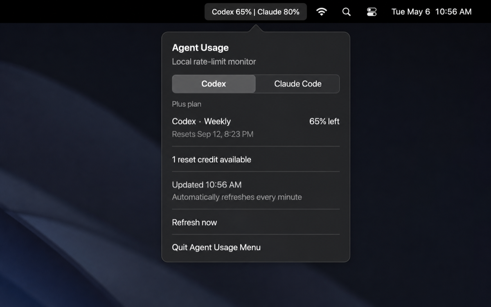

# Agent Usage Menu

A tiny native macOS menu-bar app that keeps Codex and Claude Code usage visible. The single **Agents** menu-bar label opens one tabbed popover: Codex is selected by default when both are available, while a one-provider setup shows only that provider.

It uses the Codex CLI and Claude Code already signed in on your Mac; it does not ask for, transmit, or save credentials.

 

## Preview



*Illustrative preview of the one native menu-bar popover. When both providers are available, Codex is selected by default and Claude Code is available in the second tab. When only one provider is available, only that provider is shown.*

## Requirements

- macOS 13 (Ventura) or later
- Xcode Command Line Tools (`xcode-select --install`)
- Codex CLI installed and signed in (`codex login`) to monitor Codex
- [Claude Code](https://code.claude.com/docs/en/overview) installed and signed in to monitor Claude Code

Codex and Claude Code are independently optional: install the utility once and use whichever provider(s) you have.

## Install

### npm

Install the packaged utility directly from this public repository:

```zsh
npm install -g github:saivarun1410/agent-usage-menu
agent-usage-menu install
```

To add Claude Code capture:

```zsh
agent-usage-menu install --claude
```

### From source

```zsh
git clone https://github.com/saivarun1410/agent-usage-menu.git
cd agent-usage-menu
./scripts/install.sh
```

To add Claude Code support at install time, use:

```zsh
./scripts/install.sh --claude
```

The installer compiles the app, adds it to your user LaunchAgents, and starts it. You only need to install it once: macOS starts it automatically after every future login and relaunches it if it unexpectedly exits. You do not need to keep a terminal open or run a command again.

Choosing **Quit Agent Usage Menu** from the popover is the normal way to stop monitoring; it unloads the launch agent. `swift run AgentUsageMenu` is only a development command, so stopping that Terminal process also stops that temporary copy.

To remove the installed utility permanently:

```zsh
./scripts/uninstall.sh
```

Or, for the npm install:

```zsh
agent-usage-menu uninstall
```

## How it works

### Codex

Every 60 seconds, the app starts the locally installed `codex app-server --stdio`, initializes a local JSON-RPC session, and reads `account/rateLimits/read`. It displays the returned rate-limit windows and then closes that helper process. **Refresh now** is only a manual fallback; no terminal command or user action is needed for normal updates.

This uses a local Codex app-server capability rather than scraping a web page. It is read-only, and it never reads, copies, or persists your Codex authentication files. Codex does not currently document this protocol as a public stable API, so a future Codex update may require an update to this utility.

### Claude Code

Claude Code publishes 5-hour and 7-day rate-limit data through its official [status-line JSON payload](https://code.claude.com/docs/en/statusline). With `--claude`, this utility installs a small local status-line command that saves only those percentages and reset timestamps; the menu app reads that local record each minute. Claude Code updates the record while a Claude session is active, so the popover shows when it was last captured.

When Claude Code is installed but has not yet returned a response in a session, its tab is still shown with a waiting state. It fills in after the first rate-limit payload arrives.

Claude Code allows one `statusLine` command. To protect custom setups, the installer never replaces an existing one. If you already use a custom status line, it leaves it intact and prints an integration note. Adapt that command to forward its JSON input to `~/.local/bin/claude-usage-capture` before it produces its usual output. The capture helper accepts the official JSON on standard input and writes its own short status line to standard output.

The Claude Code payload contains the 5-hour and 7-day windows; a monthly account allowance is not included, so it is not displayed here.

## Development

```zsh
swift test
swift run AgentUsageMenu
```

## Privacy

No analytics, network client, account token, or tracking is included. The Codex CLI itself contacts OpenAI to retrieve your current account quota, exactly as it does when its usage status is shown. For Claude Code, the only locally persisted information is the latest two rate-limit percentages and reset timestamps supplied by its status-line payload.

## License

[MIT](LICENSE)
